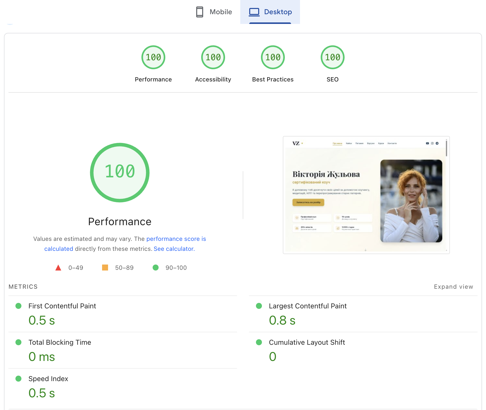
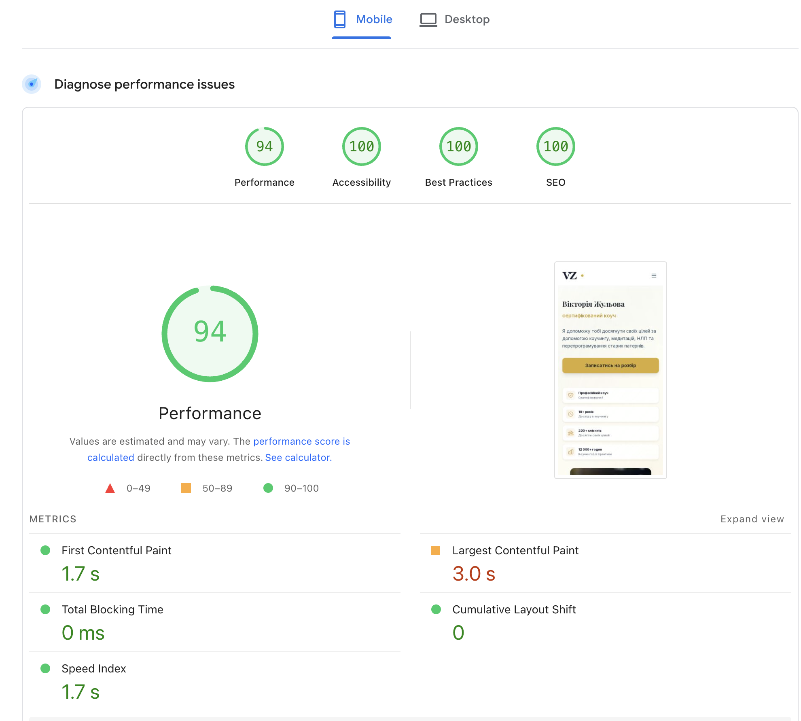

# Viktoria Zhulova - Personal Brand Website

A production website for a mindset coach, built with focus on **performance**, **accessibility**, and **modern development practices**.

**Live:** [zhulova.com](https://zhulova.com)

---

## Tech Stack

| Layer | Technologies |
|-------|-------------|
| **Frontend** | Astro 4, React 18, TypeScript 5 (strict), Tailwind CSS 3 |
| **Backend** | Vercel Serverless Functions, Supabase PostgreSQL, Resend |
| **Testing** | Vitest, Playwright, axe-core |
| **CI/CD** | GitHub Actions, Lighthouse CI |
| **Monitoring** | Vercel Analytics & Speed Insights |

---

## Key Achievements

### Performance
- **Lighthouse 100** on desktop, **94** on mobile
- **~27KB JavaScript bundle** (gzipped) - Islands Architecture, React only for forms
- **LCP < 2.0s** - responsive images with automatic srcset generation
- **Edge CDN** - sub-100ms TTFB globally

### Testing
- **151 automated tests** (78 unit + 73 E2E)
- **85% CI time savings** - fast-fail pattern (15.5 min → 3.5 min)
- **Automated PR feedback** - coverage reports, performance scores

### Accessibility
- **WCAG AA compliant** - 0 critical violations
- **Keyboard navigation** - full support with arrow keys for tabs
- **Screen reader tested** - VoiceOver & NVDA compatible
- **4.5:1 contrast ratio** - all text passes WCAG AA

---

## Testing Infrastructure

### Unit Tests (Vitest + React Testing Library)

**78 tests** covering:

| Component | What's Tested |
|-----------|--------------|
| `Button` | Variants, disabled state, click handlers |
| `Input` | Validation, error states, accessibility |
| `Modal` | Open/close, Escape key, focus trap |
| `ConsultationModal` | Form submission, validation, API integration |
| `MobileMenu` | Toggle, navigation, body scroll lock |
| `logger` | PII sanitization, log levels, truncation |
| `scrollAnimations` | IntersectionObserver, animation triggers |

```bash
npm run test           # Watch mode
npm run test:coverage  # With coverage report
```

### E2E Tests (Playwright)

**73 tests** across 5 browsers (Chromium, Firefox, Safari, Mobile Chrome, Mobile Safari):

| Suite | Tests | Coverage |
|-------|-------|----------|
| `consultation-form` | 8 | Form validation, submission, error handling |
| `consultation-cta-buttons` | 15 | All 5 CTA buttons, modal behaviors, API mocking |
| `legal-pages` | 20 | Privacy policy, terms, SEO meta tags |
| `courses-pages` | 30 | Catalog, 3 detail pages, navigation |

```bash
npm run test:e2e      # All browsers
npm run test:e2e:ui   # Interactive mode
```

---

## CI/CD Workflows

### 1. `test.yml` - Automated Testing

**Triggers:** Every PR and push to `main`

```
Unit Tests (30s) → [pass] → E2E Tests (3min) → [pass] → Summary
                → [fail] → Skip E2E (fast-fail)
```

**Features:**
- Fast-fail pattern - unit failure skips E2E (saves 85% CI time)
- Automated PR comments with test results
- Coverage reports uploaded as artifacts
- Smart artifact retention (coverage 14d, reports 30d, screenshots 7d)

### 2. `performance-gate.yml` - Quality Gate

**Blocks merge if:**
- Lighthouse Performance < 85
- Lighthouse Accessibility < 90
- JS bundle > 100KB (gzipped)
- CSS bundle > 20KB (gzipped)

### 3. `performance-monitor.yml` - Daily Monitoring

- Runs Lighthouse on production daily at 6 AM UTC
- Tracks Core Web Vitals trends
- Creates GitHub Issue on performance degradation

### 4. `performance-alerts.yml` - Alerting

- Production health checks
- Immediate notification via GitHub Issues on failures

---

## Architecture

```
┌─────────────────┐     ┌──────────────┐     ┌─────────────────┐
│  Static Pages   │ ←→  │    User      │ ←→  │ Serverless API  │
│  (Edge CDN)     │     │              │     │ (Vercel)        │
└─────────────────┘     └──────────────┘     └────────┬────────┘
                                                      │
                                             ┌────────┴────────┐
                                             │                 │
                                        ┌────▼────┐     ┌──────▼──────┐
                                        │Supabase │     │   Resend    │
                                        │   DB    │     │   Email     │
                                        └─────────┘     └─────────────┘
```

**Static-first approach:**
- All pages pre-rendered at build time
- React hydration only for interactive forms (~27KB gzipped)
- Perfect SEO - all content in HTML

---

## Development Workflow

```bash
npm install          # Install dependencies
npm run dev          # Dev server (localhost:4321)
npm run build        # Production build
npm run test         # Unit tests
npm run test:e2e     # E2E tests
npm run perf:check   # Local Lighthouse audit
```

### Spec-Driven Development

This project uses **Spec-Kit** methodology - each feature has:
- User stories with acceptance criteria
- Implementation plan
- Task breakdown
- Test requirements

**17 feature specs** completed in `specs/` directory.

---

## Project Highlights

| Feature | Implementation |
|---------|---------------|
| **Form Handling** | Native HTML5 validation + server-side Zod + Supabase storage |
| **Email Notifications** | Resend API with structured templates |
| **Error Logging** | Custom logger with PII sanitization |
| **Responsive Images** | Astro Image with automatic srcset (320/480/600px) |
| **View Transitions** | Native CSS `@view-transition` (0KB JS, Chrome/Edge 126+) |
| **Analytics** | Vercel Analytics (privacy-friendly, no cookies) |

---

## Performance (PageSpeed Insights)

| Desktop | Mobile |
|---------|--------|
|  |  |

### Key Optimizations

- **Native HTML5 validation** - browser-native form validation, server-side Zod
- **Native CSS View Transitions** - smooth page navigation without JS
- **Islands Architecture** - React only for interactive components
- **Optimized images** - responsive srcset with WebP format
- **Minimal JS bundle** - ~27KB gzipped (React core only)

---

## Security

- **Input validation** - Zod schemas on all API endpoints
- **Row Level Security** - Supabase RLS policies
- **Environment variables** - secrets never exposed to client
- **PII sanitization** - automatic in error logs

---

**Built with Astro, React, TypeScript, and modern web standards.**
