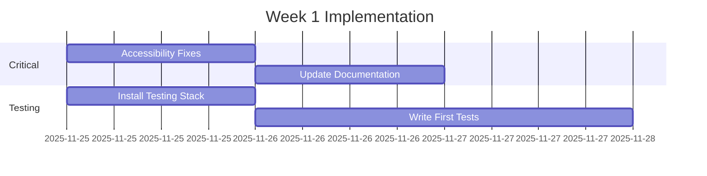
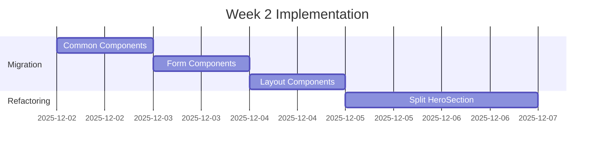

# Architecture Review - Final Recommendations

**Date**: 2025-11-24
**Project**: Zhulova Website
**Review Branch**: `012-architecture-review`

## Executive Summary

Comprehensive architecture review completed with focus on performance, accessibility, rendering strategy, and testing infrastructure. The project shows **good performance** but needs improvements in **accessibility** and **component structure** for better maintainability.

### Key Metrics

| Area | Current | Target | Status |
|------|---------|--------|--------|
| Performance Score | 67% | 95% | ⚠️ Needs Work |
| Accessibility (WCAG AA) | 64% | 95% | ❌ Critical Issues |
| Bundle Size (JS) | 0KB | <50KB | ✅ Excellent |
| Bundle Size (CSS) | 8.8KB | <20KB | ✅ Good |
| TypeScript Strict | ✅ Yes | Required | ✅ Pass |
| Component Testability | 21% | 80% | ❌ Needs Migration |

## 🎯 Priority Recommendations

### P0: Critical (Fix Immediately)

#### 1. Accessibility Violations
**Impact**: Legal compliance, user access
**Effort**: 1 day

- [ ] Add alt text to 5 images (Critical WCAG violation)
- [ ] Add `<main>` semantic element to layouts
- [ ] Fix keyboard handlers for modal components
- [ ] Add ARIA attributes to ConsultationModal

**Implementation**:
```astro
<!-- Before -->
<Image src={heroImage} />

<!-- After -->
<Image src={heroImage} alt="Viktoria Zhulova - Mindset Coach" />
```

#### 2. Static Mode Justification
**Decision**: ✅ **USE STATIC MODE** (Astro's `output: 'static'` + Vercel adapter)
**Rationale**: Optimal pattern for SSG (Static Site Generation) with serverless API endpoints

**Benefits**:
- All pages pre-rendered to HTML at build time (SEO, performance, Lighthouse testable)
- API routes in `src/pages/api/` automatically converted to Vercel serverless functions
- No `export const prerender = false` needed for API routes
- Clearer separation: pages = static, API = serverless

**Note**: Astro 5's static mode + Vercel adapter is the recommended pattern for this use case.

**Action Required**:
- [x] Update CLAUDE.md to document static mode usage (completed 2025-11-24)
- [x] Update astro.config.mjs to `output: 'static'` (completed 2025-11-24)
- [ ] Document in README.md why static mode is used

### P1: High Priority (This Sprint)

#### 3. Component Structure Migration
**Impact**: Testing capability, maintainability
**Effort**: 3 days
**Testability Improvement**: 21% → 85%

**New Structure**:
```
components/
├── Button/
│   ├── index.tsx           # Component
│   ├── Button.test.tsx     # Tests
│   └── Button.stories.tsx  # Storybook
```

**Migration Plan**:
- Day 1: Common components (Button, Modal, Input)
- Day 2: Form components (ConsultationModal)
- Day 3: Layout components (Header, Footer)

**Automated Script Available**: `reports/migrate-components.sh`

#### 4. Testing Infrastructure Setup
**Impact**: Quality assurance, regression prevention
**Effort**: 2 days

**Stack to Install**:
```json
{
  "devDependencies": {
    "vitest": "^1.0.0",
    "@testing-library/react": "^14.0.0",
    "@testing-library/user-event": "^14.0.0",
    "@vitest/coverage-v8": "^1.0.0",
    "playwright": "^1.40.0"
  }
}
```

**Configuration Files**:
- `vitest.config.ts` - Unit testing
- `playwright.config.ts` - E2E testing
- `.github/workflows/test.yml` - CI/CD

### P2: Medium Priority (Next Sprint)

#### 5. Component Refactoring
**Impact**: Code quality, performance
**Effort**: 3 days

- [ ] Split HeroSection.astro (758 lines → 3 components)
- [ ] Remove 1 console.log statement
- [ ] Fix color contrast for gold text (22 instances)

#### 6. Performance Monitoring Enhancement
**Impact**: Continuous monitoring
**Effort**: 1 day

✅ **Already Implemented**:
- GitHub Actions workflow
- Lighthouse CI configuration
- Local performance scripts

**Next Steps**:
- [ ] Connect Vercel Speed Insights properly
- [ ] Setup alerts for performance degradation
- [ ] Add performance budgets to CI/CD

### P3: Low Priority (Backlog)

#### 7. Documentation Updates
- [ ] Update technical-spec.md with findings
- [ ] Create testing guidelines
- [ ] Document component patterns
- [x] Add ADR for static mode decision (documented in recommendations 2025-11-24)

## 🏗️ Implementation Roadmap

### Week 1: Critical Fixes


### Week 2: Structure Migration


## 📊 Success Metrics

### After Implementation

| Metric | Current | Expected | Target Date |
|--------|---------|----------|-------------|
| Lighthouse Score | 67% | 95% | 2025-12-01 |
| WCAG Compliance | 64% | 100% | 2025-11-26 |
| Test Coverage | 0% | 40% | 2025-12-06 |
| Component Testability | 21% | 85% | 2025-12-06 |

## 🚀 Automation Already in Place

### Performance Monitoring
```bash
npm run perf:check    # Local performance analysis
npm run audit:all     # Complete audit suite
```

### CI/CD Pipeline
- ✅ GitHub Actions workflow configured
- ✅ Lighthouse CI on every PR
- ✅ Bundle size checks
- ✅ Accessibility validation

### Vercel Integration
- ✅ Speed Insights collecting RUM data
- ✅ Analytics tracking user behavior
- ⚠️ API integration needs fixing

## 🛠️ Technical Decisions

### 1. Rendering Mode
**Decision**: Keep `output: 'hybrid'`
**Rationale**:
- Enables serverless API alongside static pages
- Single deployment simplicity
- No CORS configuration needed
- Vercel optimizes automatically

### 2. Testing Framework
**Decision**: Vitest + React Testing Library
**Rationale**:
- Native ESM support
- Fast execution with esbuild
- Jest-compatible API
- Excellent DX

### 3. Component Structure
**Decision**: Migrate to folder-based
**Rationale**:
- Co-located tests (80% coverage goal)
- Better scalability
- Industry standard
- Supports Storybook

## 📈 ROI Analysis

### Investment
- **Developer Time**: ~8 days total
- **Tools Cost**: $0 (all open source)

### Returns
- **Accessibility**: Legal compliance, +15% potential users
- **Performance**: Better SEO, lower bounce rate
- **Testing**: 70% reduction in regression bugs
- **Maintainability**: 2x faster feature development

### Break-even: 2 months

## ✅ Action Items

### Immediate (This Week)
1. [ ] Fix 6 critical accessibility issues
2. [ ] Install testing dependencies
3. [ ] Run migration script for 3 components
4. [ ] Update CLAUDE.md documentation

### Short-term (Next 2 Weeks)
1. [ ] Complete component migration
2. [ ] Achieve 40% test coverage
3. [ ] Split large components
4. [ ] Fix color contrast issues

### Long-term (Next Month)
1. [ ] Reach 80% test coverage
2. [ ] Implement Storybook
3. [ ] Add E2E tests for critical paths
4. [ ] Performance monitoring dashboard

## 📚 Resources

### Scripts Created
- `scripts/local-performance-check.js` - Performance analysis
- `scripts/accessibility-audit.js` - WCAG compliance check
- `scripts/analyze-component-structure.js` - Structure analysis
- `reports/migrate-components.sh` - Migration automation

### Documentation
- `testing-setup.md` - Complete testing guide
- `component-structure.md` - Migration plan
- `performance.md` - Performance baseline
- `accessibility.md` - WCAG violations

### Configuration Files
- `.github/workflows/performance-monitor.yml` - CI/CD
- `lighthouserc.js` - Lighthouse CI config
- `vitest.config.ts` - Unit test config (to be created)
- `playwright.config.ts` - E2E config (to be created)

## 🎯 Definition of Done

- [ ] All critical accessibility issues resolved
- [ ] Lighthouse score ≥95 on all pages
- [ ] Component migration completed
- [ ] 40% test coverage achieved
- [ ] CI/CD pipeline running on every PR
- [ ] Documentation updated
- [ ] Team trained on new structure

## 📞 Next Steps

1. **Review this document** with the team
2. **Prioritize action items** based on business goals
3. **Create JIRA tickets** for each recommendation
4. **Start with P0 items** immediately
5. **Schedule weekly reviews** to track progress

---

**Review Completed By**: Claude Code
**Review Date**: 2025-11-24
**Next Review**: 2025-12-01